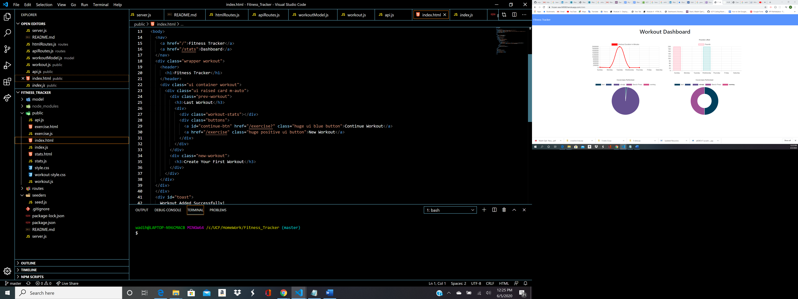

# Fitness_Tracker

Project Title
This is a workout tracker application where the user can register all their workouts cardio/lifting.
When it comes to training it is really important to keep track of your training regime. Tracking anything will help you improve.
Imagine what you can achieve if you applied this method to your workout routine.

Getting Started
You can get a verison of this product up and running through heroku and can see the backend code through the github
page.

Prerequisites
Install
-mongoose
-express
-morgan

Deployment
Heroku

Try Me Live
<a href="https://frozen-sea-84568.herokuapp.com"> https://frozen-sea-84568.herokuapp.com/ </a>

Built With
Mongoose
Express
Morgan

Authors

Wadih Ojeil- Full Stack Web Developer

License
This project is licensed under the ISC License

## Purpose and Inspiration
To train myself and work on mongoose ORM combine with full RESTful CRUD. 

## MVC
This project is structured in Full Stack Javascript with Mongoose Models. 

## Tech Stack
+ [MONGOOSE ORM](https://www.npmjs.com/package/mongoose)
+ [EXPRESS](https://www.npmjs.com/package/express)
+ [NODE](https://nodejs.org/en/)

#### Install and run
Install all the dependencies with NPM
`npm install`  
Make sure you start Mongod and have mongoDB running..
`mongod`  
Then start the project
`node server.js`

